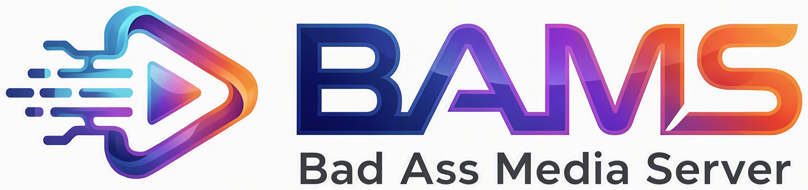

<p align="center"></p>

# BAMS — Bad Ass Media Server

A self-hosted, Netflix/Plex-style server for **your own** movies, TV shows and music.
Point it at folders on a local or mounted drive. It finds and identifies your media, pulls posters and
descriptions, and streams to any browser. It runs on **Windows** and **Debian / Ubuntu / Linux Mint**.

> **Status: early.** The server (Python) indexes and identifies TV/movie folders (matched on TMDB) and
> music folders (tags, then MusicBrainz), and streams files. See [server/README.md](server/README.md). The web UI shows your real
> libraries and plays anything: the server converts what the browser can't decode, with subtitles, audio
> tracks, and per-person accounts with resume and Continue Watching.
> The full plan is in [docs/PLAN.md](docs/PLAN.md).
>
> Your media folders are **read-only** to BAMS, enforced in code and by the OS: [docs/READ-ONLY.md](docs/READ-ONLY.md).

## Run it

Start the server (see [server/README.md](server/README.md)). It serves the UI at http://127.0.0.1:8484; the first
visit, on the server itself, creates the admin account.
After changing the UI, rebuild it (Node 20+):

```bash
cd web && npm install && npm run build
```

For UI development with hot reload, run `npm run dev` in `web/` and open http://localhost:5173.
It proxies `/api` to the server.

## Layout

| Path | What |
|---|---|
| `CLAUDE.md` | Rules and pitfalls for AI coding sessions (read first) |
| `docs/STATUS.md` | What's built, requirements, decisions log, dev environment |
| `docs/CODEBASE.md` | Codebase map: every file, data flow, DB schema, API, "where to change X" |
| `docs/FORMATS.md` | Every video/audio/subtitle/music format and how BAMS handles it |
| `docs/PLAN.md` | Architecture, how Plex works, metadata/licensing decisions, phases |
| `docs/READ-ONLY.md` | How media folders are kept read-only (code guard + OS setup) |
| `server/` | Python server: scanner, TMDB and MusicBrainz matchers, API, CLI, tests |
| `deploy/linux/bams.service` | Hardened systemd unit (media read-only at the kernel level) |
| `web/` | React + Vite + TypeScript UI, served by the server from `web/dist` |
| `branding/logo/` | Logo files. `*-transparent.png` are cut-outs for dark backgrounds |
| `tools/brand_art/rework.py` | Redraws the logo set through local ComfyUI (Qwen Image 2.1 edit) and rebuilds the cut-outs |

## License

[MIT](LICENSE). Metadata providers have their own terms (see PLAN.md §5). BAMS uses the TMDB API but is not
endorsed or certified by TMDB. Plex is a trademark of Plex, Inc. BAMS is not affiliated with or endorsed by Plex.
